# # Veri Okur-Yazarlığı - Data Literacy

Popülasyon - population : Veri bilimi uygulamasında ilgilendiğimiz ana kitlemizdir.

Örneklem - Sample : Popülasyon içerisinden seçilen bir alt kümedir. Örneklem popülasyonun özelliklerini temsil etmesi ve yansız olması gerekir. Örnekse 80 milyon kişinin katıldığı bir seçim için bu kitleyi temsil eden iyi bir örneklemin incelenmesi daha uygun olur.

Observation Unit - Gözlem Birimi : Verideki her bir satır veri bir gözlem birimidir.

Variables and Variables Types - Değişkenler ve Değişken Türleri : Değişkenler birimden birime farklı değerler alan niceliklerdir.
Değişken türleri
- Sayısal Değişkenler (nicel, kantitatif)
- Kategorik Değişkenler (nitel, kalitatif) 

Ölçek Türleri - Scale of Measurement
- Sayısal değişkenler için : Aralık ve Oran
> Aralık : Başlangıç noktası sıfır olmayan sayısal değişkenlerin ölçek türü aralıktır. Sıcaklık vs.
> Oran : Başlangıç noktasını sıfır kabul eden sayısal değişkenlerin ölçek türü orandır. Fiyat, km vs.
- Kategorik değişkenler için : Nominal ve Ordinal
> Nominal : Cinsiyet bir kategorik değişkendir. "Kadın" ve "Erkek" is bu kategorik değişkenin sınıflarıdır. "Kadın" ve "Erkek" sınıfları arasında fark olmadığı için bu değişken nominal ölçek türüne sahiptir.
> Ordinal : Rütbe bir kategorik değişkendir. Bu kategorik değişkenin sınıfları: Onbaşı - Yüzbaşı - Binbaşı - Albay dır. Değişkenin sınıfları arasında fark olduğu için "Rütbe" değişkeni ordinaldir.

# # Merkezi Eğilim Ölçüleri

Arithmetic Mean - Aritmetik Ortalama : Bir seride (değişkende) yer alan tüm değerlerin toplanması ve birim sayısına bölünmesiyle elde edilen istatistiktir.

Median - Medyan : Bir seriyi küçükten büyüğe veya büyükten küçüğe sıraladığımızda tam orta noktadan seriyi iki eşit parçaya ayıran değere medyan adı verilir.

Mode - Mod : Bir seride (değişkende) en çok tekrar eden değere mod adı verilir

Quartiles - Kartiller : Küçükten büyüğe sıralanan bir seriyi 4 parçaya ayıran değerlere kartiller denir.

# # Dağılım ölçüleri - Measures of Dispersion

Değişim Aralığı - Range : Max değerden min değeri çıkardığımızda elde edilen veridir. 

Standart Sapma - Standard Deviation : Ortalamadan olan sapmaların genel bir ölçüsüdür. Ortalamadan olan sapmaların ortalamasıdır.

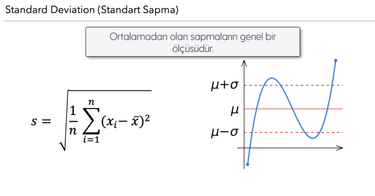

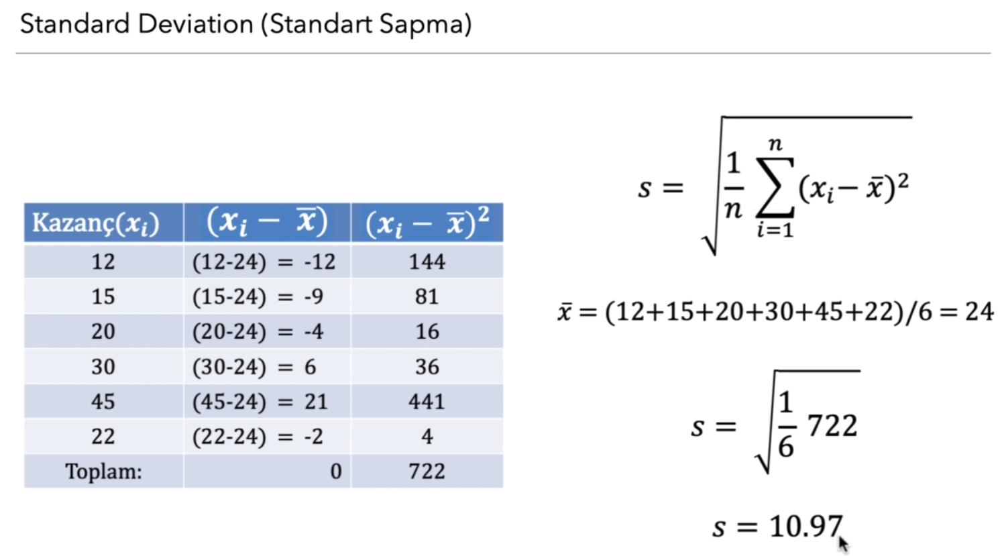


```python
Varyans - Variance : Standart sapmanın karesidir. Ortalamadan olan sapmaların karelerinin ortalamasıdır.
```

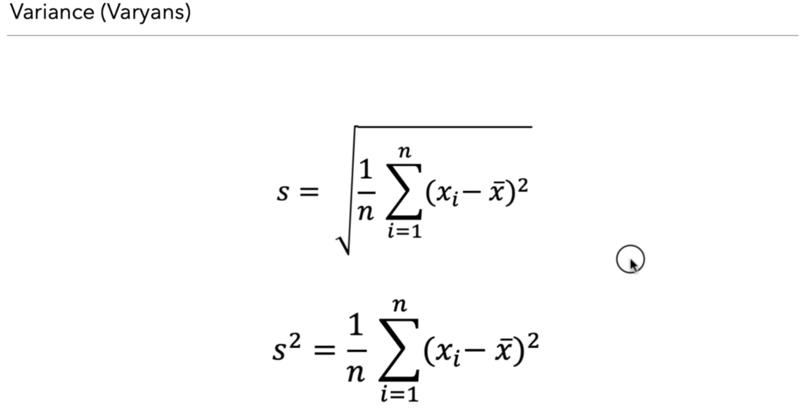

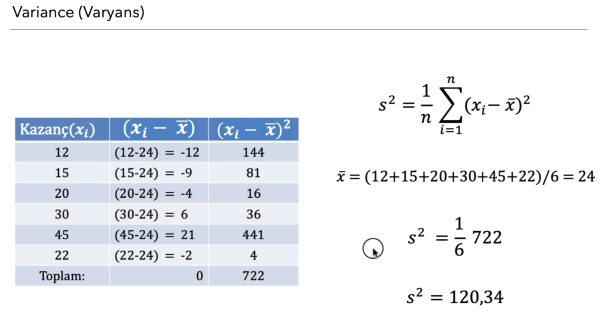

Çarpıklık - Skewness : Çarpıklık bir değişkenin dağılımının simetrik olamayışıdır. Çarpıklık varsa veri medyan değeri ile temsil edilmelidir.

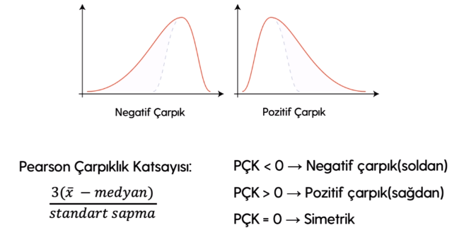

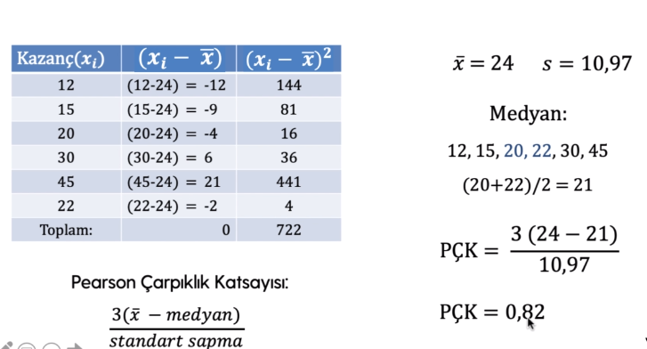

Kurtosis - Basıklık : Dağılımın basıklığını/sivriliğini gösterir.

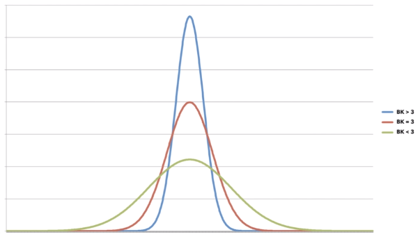

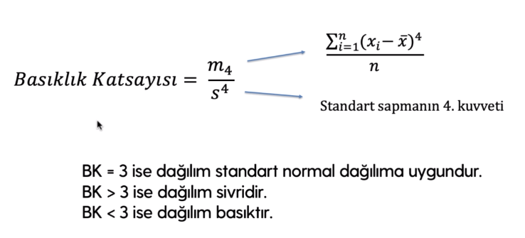

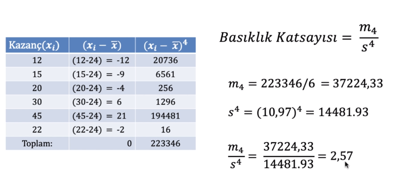

# # Statistical Thinking Models - İstatistiksel Düşünce Modelleri

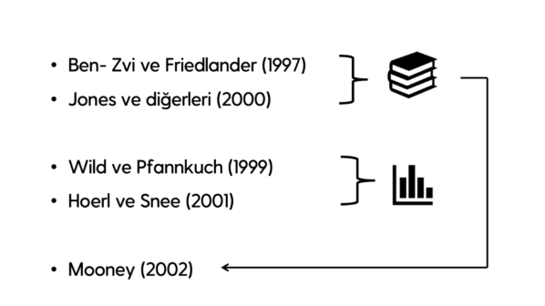

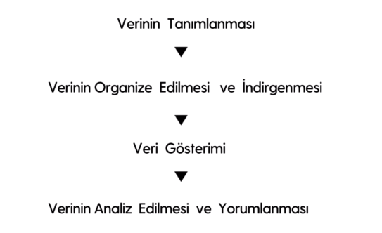

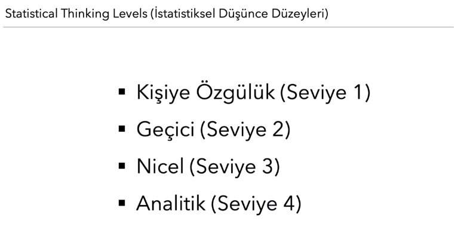
